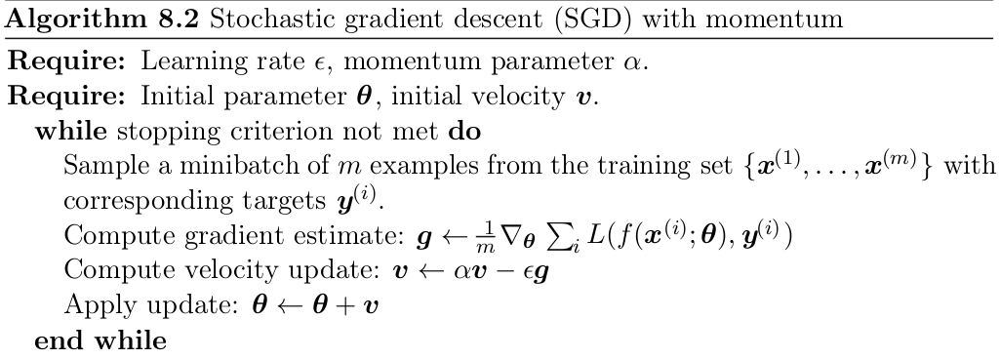
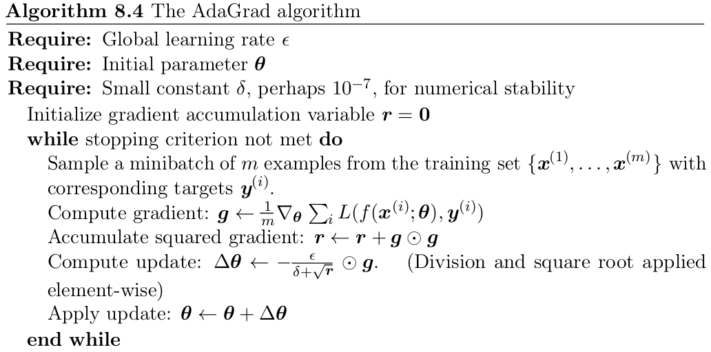
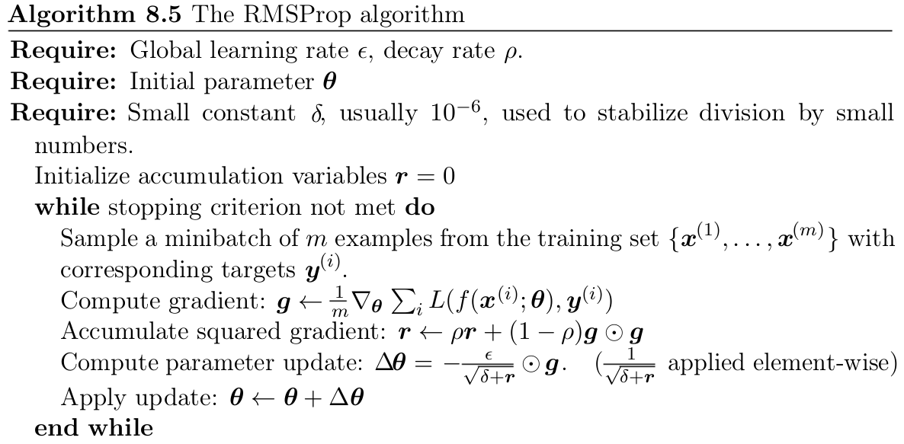
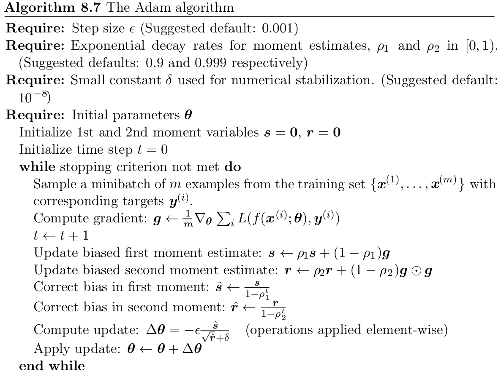

# July 28, 2025 (Class 1)

Course Logistics

# July 29, 2025 (Class 2)

Paper reading: Nature Review "Deep Learning", LeCun et al.

# August 1, 2025 (Class 3)

Continued paper reading: Nature Review "Deep Learning", LeCun et al.

# August 4, 2025 (Class 4)

## Supervised Learning Setting

### Data

Let $\underbar{x} \in \mathcal{X}$ be the input data, where $\mathcal{X}$ is the input space, and $y \in \mathcal{Y}$ is the corresponding label, where $\mathcal{Y}$ is the label space.
We define
$$
\begin{aligned}
    \mathcal{D}_{train} &= {(\underbar{x}_i^t, y_i^t)}_{i=1}^N \\
    \mathcal{D}_{val} &= {(\underbar{x}_i^v, y_i^v)}_{i=1}^M \\
\end{aligned}
$$

#### Setting: $(\underbar{x}, y) \in p(\underbar{x}, y)$, where $p$ is a fixed but unknown distribution over $\mathcal{X} \times \mathcal{Y}$.

### Model/Machine
A parameterized function $f(\underbar{x} ; \theta)$ that maps an input data point $\underbar{x}$ to a label $\widehat{y}$.
$$
f : \mathcal{X} \times \mathcal{H} \to \mathcal{Y}
$$
where $\mathcal{H}$ is the parameter space, and $\theta$ are the parameters of the model.

$$
f(\underbar{x}:\theta) = f_L^{(\theta_L)} \circ f_{L-1}^{(\theta_{L-1})} \circ \ldots \circ f_1^{(\theta_1)}
$$
In several settings, we have a template or a building block model.

#### Multi-Layer Perceptron (MLP)
$$
f = \sigma(\underbar{W} \underbar{x} + \underbar{b})
$$
where $\sigma$ is a non-linear activation function, $\underbar{W}$ is the weight matrix, and $\underbar{b}$ is the bias vector.

#### Convolutional Neural Network (CNN)
$$
f = \sigma(\text{Conv}(\underbar{W}, \underbar{x}) + \underbar{B})
$$
where $\sigma$ is a non-linear activation function, $\text{Conv}$ is the convolution operation, $\underbar{W}$ is the filter/kernel, and $\underbar{B}$ is the bias term.

#### Transformer
$$
f = \text{Transformer}(\underbar{x}, \theta)
$$

#### Recurrent Neural Network (RNN)
$$
f^t = \sigma(\underbar{W} \cdot \underbar{x}^t + R \cdot f^{t-1} )
$$
where $\sigma$ is a non-linear activation function, $\underbar{W}$ is the weight matrix, $R$ is the recurrent weight matrix, and $f^{t-1}$ is the output from the previous time step.

### Optimization
We want to find the parameters $\theta$ such that the model

- Low training loss, i.e. on $\mathcal{D}_{train}$
- Generalizes well, i.e. low validation loss on $\mathcal{D}_{val}$

Let per sample distance be defined as
$$
d: \underbar{y} \times \underbar{y} \to \mathbb{R}
$$
Let the loss $\mathcal{L}(\theta)$ be defined as
$$
\mathcal{L}(\theta) = \frac{1}{N} \sum_{i=1}^N d(f(\underbar{x}_i ; \theta), y_i)
$$

We want to find the optimal parameters $\theta^*$ such that
$$
\theta^* = \arg\min_{\theta \in \mathcal{H}} \mathcal{L}(\theta)
$$

# August 5, 2025 (Class 5)

# August 8, 2025 (Class 6)

# August 11, 2025 (Class 7)

# August 12, 2025 (Class 8)

# August 18, 2025 (Class 9)

# August 19, 2025 (Class 10)

# August 21, 2025 (Class 11)

# August 25, 2025 (Class 12)

# August 26, 2025 (Class 13)

# August 29, 2025 (Class 14)

# September 1, 2025 (Class 15)

# September 2, 2025 (Class 16)

# September 4, 2025 (Class 17)

## Momentum
The momentum update rule is defined as,
$$
\begin{aligned}
    \mathbf{\upsilon} &\leftarrow \alpha \mathbf{\upsilon} - \epsilon \nabla_\theta \left( \dfrac{1}{m} \sum_{i=1}^{m} L\left( f(x^{(i)}; \theta ), y^{(i)} \right) \right) \\
    \theta &\leftarrow \theta + \mathbf{\upsilon}.
\end{aligned}
$$

## Nesterov Momentum

The Nesterov momentum rule is defined as,
$$
\begin{aligned}
    \mathbf{\upsilon} &\leftarrow \alpha \mathbf{\upsilon} - \epsilon \nabla_\theta \left( \dfrac{1}{m} \sum_{i=1}^{m} L\left( f(x^{(i)}; \theta + \alpha \upsilon ), y^{(i)} \right) \right) \\
    \theta &\leftarrow \theta + \mathbf{\upsilon}.
\end{aligned}
$$

# September 8, 2025 (Class 18)

# September 9, 2025 (Class 19)

# AdaGrad (Adaptive Gradient)

## RMSProp

## Adam (Adaptive Moments)

## Generative Adversarial Networks
See [[Generative Adversarial Networks]].

## Variational Autoencoders
See [[Variational Autoencoders]]

### See also

### References