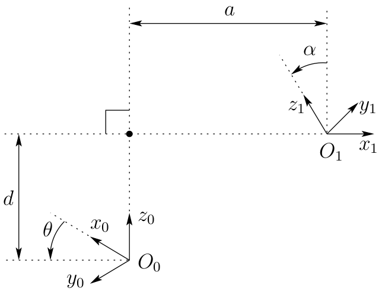
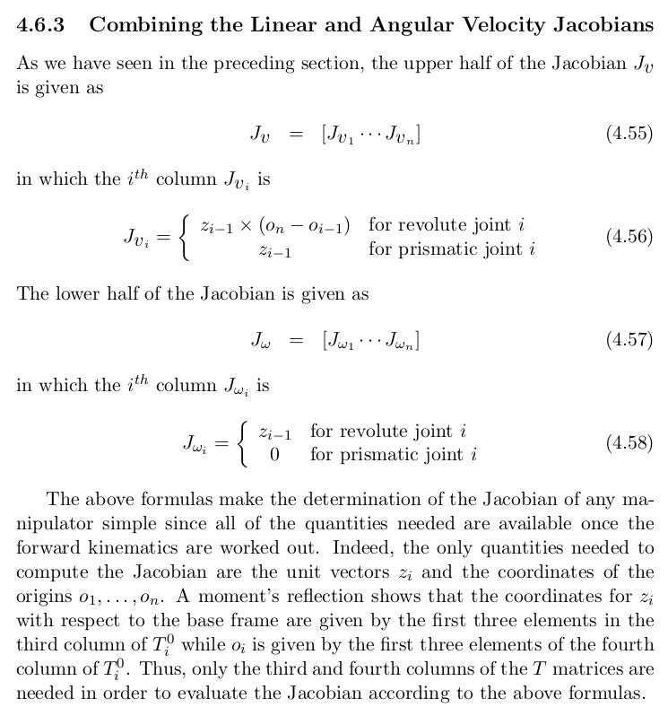

---

---
# July 29, 2025 (Class 1)

# (Class 2)

# (Class 3)

## Representing positions

![[AI4000 Robotics_tikz_0.svg]]

$P$ in frame $0$,
$$
P^0 = \begin{bmatrix}
        4 \\
        4
    \end{bmatrix}
$$
$P$ in frame $1$,
$$
P^1 = \begin{bmatrix}
        1 \\
        2
    \end{bmatrix}
$$

## Representing rotation in 2D

### Representing rotation using $\theta$

### Representing rotation using rotation matrix

### Representing rotation using direction cosine matrix

For frames $o_0x_0y_0$ and $o_1x_1y_1$, the direction cosine matrix from frame 1 to frame 0 is
$$
R^0_1 = \begin{bmatrix}
        x_1 . x_0 & y_1 . x_0 \\
        x_1 . y_0 & y_1 . y_0
    \end{bmatrix}
$$
Similarly, the direction cosine matrix from frame 0 to frame 1 is
$$
R^1_0 = \begin{bmatrix}
        x_0 . x_1 & y_0 . x_1 \\
        x_0 . y_1 & y_0 . y_1
    \end{bmatrix}
$$
Note that $R^1_0 = (R^0_1)^T$, since it is belongs to special orthogonal group $SO(2)$.

## Representing rotation in 3D

## The basic rotation matrices in 3D

$$
R_{x,\theta} = \begin{bmatrix}
        1 & 0 & 0 \\
        0 & \cos\theta & -\sin\theta \\
        0 & \sin\theta & \cos\theta
    \end{bmatrix}
$$
$$
R_{y,\theta} = \begin{bmatrix}
        \cos\theta & 0 & \sin\theta \\
        0 & 1 & 0 \\
        -\sin\theta & 0 & \cos\theta
    \end{bmatrix},
$$
$$
R_{z,\theta} = \begin{bmatrix}
        \cos\theta & -\sin\theta & 0 \\
        \sin\theta & \cos\theta & 0 \\
        0 & 0 & 1
    \end{bmatrix},
$$

## Rotational transformations

Let $p^1$ be a point in frame 1, and $p^0$ be the same point in frame 0. Then,
$$
p^0 = R^0_1 p^1
$$
where $R^0_1$ is the rotation matrix from frame 1 to frame 0.

### Example:
The vector $v$ with coordinates $v^0 = (0,1,1)^T$ is rotated about $y_0$ by $\frac{\pi}{2}$. The resulting vector $v_1$ has coordinates given by
$$
\begin{aligned}
    v_1^0 &= R_{y,\pi/2} v^0 \\
          &= \begin{bmatrix}
                0 & 0 & 1 \\
                0 & 1 & 0 \\
                -1 & 0 & 0
            \end{bmatrix}
            \begin{bmatrix}
                0 \\
                1 \\
                1
            \end{bmatrix} =
            \begin{bmatrix}
                1 \\
                1 \\
                0
            \end{bmatrix}
\end{aligned}
$$

# (Class 4)

## Similarity transformations

## Composition of rotations

# (Class 5)

## Euler angles

For a fixed frame $o_0x_0y_0z_0$ and a rotating frame $o_1x_1y_1z_1$, the Euler angles $(\phi, \theta, \psi)$ are defined as follows:

- Rotate frame $o_0x_0y_0z_0$ by $\phi$ about $z_0$ to get an intermediate frame $o_ix_iy_iz_i$.
- Rotate frame $o_ix_iy_iz_i$ by $\theta$ about $y_i$ to get another intermediate frame $o_jx_jy_jz_j$.
- Rotate frame $o_jx_jy_jz_j$ by $\psi$ about $z_j$ to get the final frame $o_1x_1y_1z_1$.

The resulting rotation matrix from frame 1 to frame 0 is given by
$$
\begin{aligned}
    R^0_1 &= R_{z,\phi} R_{y,\theta} R_{z,\psi} = R_{XYZ} \\
          &= \begin{bmatrix}
                c_\phi & -s_\phi & 0 \\
                s_\phi & c_\phi & 0 \\
                0 & 0 & 1
            \end{bmatrix}
            \begin{bmatrix}
                c_\theta & 0 & s_\theta \\
                0 & 1 & 0 \\
                -s_\theta & 0 & c_\theta
            \end{bmatrix}
            \begin{bmatrix}
                c_\psi & -s_\psi & 0 \\
                s_\psi & c_\psi & 0 \\
                0 & 0 & 1
            \end{bmatrix} \\
          &= \begin{bmatrix}
                c_\phi c_\theta c_\psi - s_\phi s_\psi & -c_\phi c_\theta s_\psi - s_\phi c_\psi & c_\phi s_\theta \\
                s_\phi c_\theta c_\psi + c_\phi s_\psi & -s_\phi c_\theta s_\psi + c_\phi c_\psi & s_\phi s_\theta \\
                -s_\theta c_\psi & s_\theta s_\psi & c_\theta
            \end{bmatrix}
\end{aligned}
$$

The matrix $R_{XYZ}$ is also known as the ZYZ Euler Angle Transformation.

The problem is, given a matrix $R \in SO(3)$,
$$
R = \begin{bmatrix}
        r_{11} & r_{12} & r_{13} \\
        r_{21} & r_{22} & r_{23} \\
        r_{31} & r_{32} & r_{33}
    \end{bmatrix}
$$
determine the Euler angles $(\phi, \theta, \psi)$, such that $R = R_{XYZ}$.

### Solution to the inverse kinematics problem for orientations

## Roll-pitch-yaw angles

## Axis-angle representation

Given a rotation matrix $R$,
$$
R = \begin{bmatrix}
        r_{11} & r_{12} & r_{13} \\
        r_{21} & r_{22} & r_{23} \\
        r_{31} & r_{32} & r_{33}
    \end{bmatrix},
$$
we have $(\mathbf{k}, \theta)$, such that
$$
\begin{aligned}
    \theta &= \cos^{-1}\left(\dfrac{r_{11} + r_{22} + r_{33} - 1}{2}\right) \\
    \mathbf{k} &= \dfrac{1}{2\sin\theta}
    \begin{bmatrix}
        r_{32} - r_{23} \\
        r_{13} - r_{31} \\
        r_{21} - r_{12}
    \end{bmatrix}
\end{aligned}
$$

# August 25, 2025 (Class 6)

## Exponential coordinates

Let $M$ be a $n\times n$ matrix.

We have,
$$
e^M = \dfrac{M^0}{0!} + \dfrac{M^1}{1!} + \dfrac{M^2}{2!} + \cdots
$$
Furthermore,
$$
\begin{aligned}
    e^0 &= I \\
    (e^M)^T &= e^{M^T} \\
    e^M e^N &= e^{M+N} \quad \text{if M and N commute} \\
\end{aligned}
$$

Let $\mathbf{k} = (k_x, k_y, k_z)^T$ be a $3$-dim vector.
We define an operator $S$ on $\mathbf{k}$ as,
$$
S(\mathbf{k}) = \begin{bmatrix}
        0 & -k_z & k_y \\
        k_z & 0 & -k_x \\
        -k_y & k_x & 0
    \end{bmatrix},
$$
where $S^T + S = 0$ (S is skew-symetric matrix).

From this we have,
$$
e^{S(\mathbf{k}\theta)} = \mathbf{I} + S(\mathbf{k}\theta) + \dfrac{S(\mathbf{k}\theta)^2}{2!} + \dfrac{S(\mathbf{k}\theta)^3}{}{3!} + \cdots
$$

### Rodrigues' formula

$$
e^{S(\mathbf{k})\theta} = \mathbf{I} + sin(\theta)S(\mathbf{k}) + (1-cos(\theta))S^2(\mathbf{k})
$$

## Rigid motion

Rigid motion is pure translation together with pure rotation.

## Homogeneous transformations

We have a homogeneous transformation matrix $H$ defined as,
$$
H = \begin{bmatrix}
        R & d \\
        0 & 1
    \end{bmatrix},
    \quad R \in SO(3), \quad d \in \mathbb{R}^3
$$

### Elementary Homogeneous transformations

$$
Trans_{x,a} = \begin{bmatrix}
        1 & 0 & 0 & a \\
        0 & 1 & 0 & 0 \\
        0 & 0 & 1 & 0 \\
        0 & 0 & 0 & 1
    \end{bmatrix} \qquad
    Rot_{x, \alpha} = \begin{bmatrix}
        1 & 0 & 0 & 0 \\
        0 & cos\alpha & -sin\alpha & 0 \\
        0 & sin\alpha & cos\alpha & 0 \\
        0 & 0 & 0 & 1
    \end{bmatrix}
$$

$$
Trans_{y,b} = \begin{bmatrix}
        1 & 0 & 0 & 0 \\
        0 & 1 & 0 & b \\
        0 & 0 & 1 & 0 \\
        0 & 0 & 0 & 1
    \end{bmatrix} \qquad
    Rot_{y, \beta} = \begin{bmatrix}
        cos\beta & 0 & sin\beta & 0 \\
        0 & 1 & 0 & 0 \\
        -sin\beta & 0 & cos\beta & 0 \\
        0 & 0 & 0 & 1
    \end{bmatrix}
$$

$$
Trans_{z,c} = \begin{bmatrix}
        1 & 0 & 0 & 0 \\
        0 & 1 & 0 & 0 \\
        0 & 0 & 1 & c \\
        0 & 0 & 0 & 1
    \end{bmatrix} \qquad
    Rot_{z, \gamma} = \begin{bmatrix}
        cos\gamma & -sin\gamma & 0 & 0 \\
        sin\gamma & cos\gamma & 0 & 0 \\
        0 & 0 & 1 & 0 \\
        0 & 0 & 0 & 1
    \end{bmatrix}
$$

### Composition rules for Homogeneous transformations

Given a homogeneous transformation $H^0_1$, if a second rigid motion $H \in SE(3)$ is performed,

1. relative to the **current** frame, then
$$
H^0_2 = H^0_1 H
$$
2. relative to the **fixed** frame, then
$$
H^0_2 = HH^0_1
$$

## Forward kinematics: DH convention

$$
\begin{aligned}
    A_i &= Rot_{z,\theta_i}Trans_{z,d_i}Trans_{x,a_i}Rot_{x,\alpha_i} \\
    &= \begin{bmatrix}
        c_{\theta_i} & -s_{\theta_i} c_{\alpha_i} &  s_{\theta_i} s_{\alpha_i} & a_i c_{\theta_i} \\
        s_{\theta_i} &  c_{\theta_i} c_{\alpha_i} & -c_{\theta_i} s_{\alpha_i} & a_i s_{\theta_i} \\
        0            &  s_{\alpha_i}           &   c_{\alpha_i}           & d_i           \\
        0            &  0                      &  0                    & 1
    \end{bmatrix}
\end{aligned}
$$

$(a_i, \alpha_i, d_i, \theta_i)$ are called **link length**, **link twist**, **link offset**, **joint angle**.

DH Coordinate Frame Assumptions

1. The axis $x_1$ is perpendicular to the axis $z_0$.
2. The axis $x_1$ intersects the axis $z_0$.

## Formulas

### Derivative of a rotation matrix
$$
\dfrac{d}{d\theta} R_{k,\theta} = S(k) R_{k,\theta}
$$

### Angular velocity, general case
$$
\begin{aligned}
    \dot{R(t)} &= S(t)R(t) \\
    \dot{R(t)} &= S(\omega(t))R(t)
\end{aligned}
$$

### Addition of angular velocities
Let
$$
R^0_n = R^0_1 R^1_2 \dots R^{n-1}_n
$$
then
$$
\dot{R^0_n} = S(\omega^0_{0,n})R^0_n
$$
where
$$
\begin{aligned}
    \omega^0_{0,n} &= \omega^0_{0,1} + R^0_1 \omega^1_{1,2} + \dots + R^0_{n-1} \omega^{n-1}_{n-1,n} \\
    &= \omega^0_{0,1} + \omega^0_{1,2} + \dots + \omega^0_{n-1,n}
\end{aligned}
$$

### Linear velocity of a point attached to a moving frame

Let $f_0$ and $f_1$ be two frames with $f_1$ moving relative to $f_0$, and
$$
H^0_1(t) = \begin{bmatrix}
        R^0_1(t) & o^0_1(t) \\
        0        & 1        \\
    \end{bmatrix}
$$
be a time dependent homogeneous transformation relating the two frames.
Now,
$$
p^0 = R^0_1 p^1 + o^0_1
$$
and
$$
\begin{aligned}
    \dot{p}^0 &= \dot{R}^0_1 p^1 + \dot{o}^0_1 \\
    &= S(\omega) R^0_1 p^1 + \dot{o}^0_1 \\
    &= \omega \times r + \upsilon
\end{aligned}
$$

If the point $p$ is moving w.r.t $f_1$, Then
$$
\dot{p}^0 = \dot{R}^0_1 p^1 + R^0_1 \dot{p}^1 + \dot{o}^0_1
$$

### See also

### References